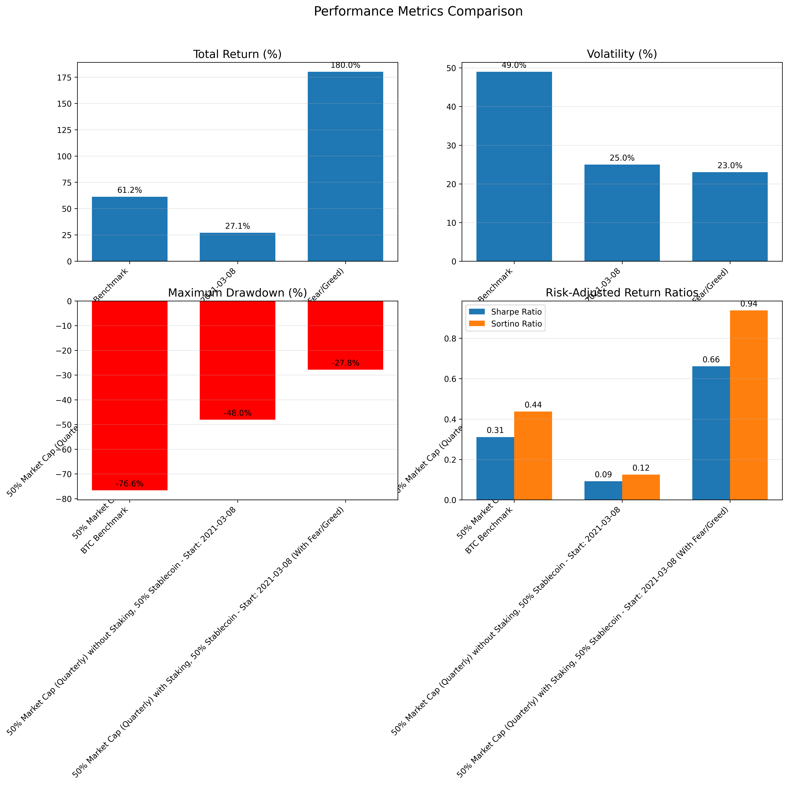

# Index500

A web3 index fund

## Installation

1. poetry install
2. yarn

## Run

`python main.py --start-date=2021-03-02 --fear-greed-file=./dataset/fear_and_greed.json --stablecoin-allocation=0.5`

## Performance

## How We Calculate the Weight of Each Token in Our Web3 Index Fund:

1. Start with the Top 10 Tokens (Excluding Stablecoins): We first identify the top 10 tokens in the Web3 ecosystem based on market capitalization. Stablecoins are excluded to ensure we're only capturing assets with real price exposure.
2. Calculate Total Market Cap: We sum the market capitalizations of these 10 tokens to get the total market cap of the index set.
3. Determine Each Token’s Weight: For each token, we divide its individual market cap by the total market cap.

This gives us the proportional weight of each token in the index, reflecting its relative size in the ecosystem.

### Numbers (2025/05/21)

1. btc: 73% = (btc+wbtc) / total = (2112049416206+13704675396)/2892707663012
2. eth: 11.6% = (eth+steth+wsteth) / total = (304662365084+22792158411+10509168437)/2892707663012
3. xrp: 4.7% = (137065385158)/2892707663012
4. bnb: 3.3% = (95102161955)/2892707663012
5. sol: 3% = (87426947468)/2892707663012
6. doge: 1.2% = (33657299707)/2892707663012
7. ada: 1.1% = (26977071650)/2892707663012
8. trx: 0.9% = (25721576964)/2892707663012
9. sui: 0.4% = (12777337555)/2892707663012
10. link: 0.4% = (10262099021)/2892707663012